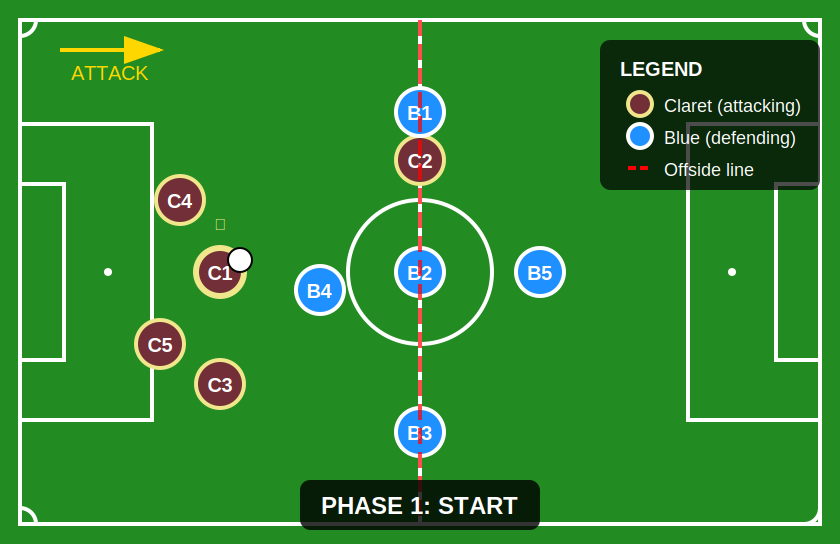
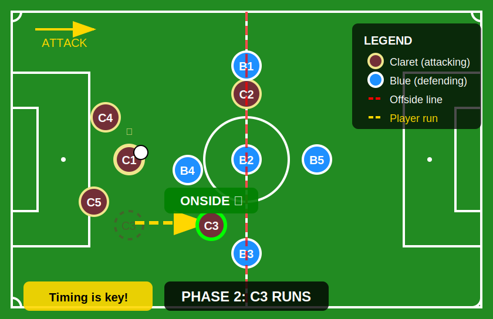
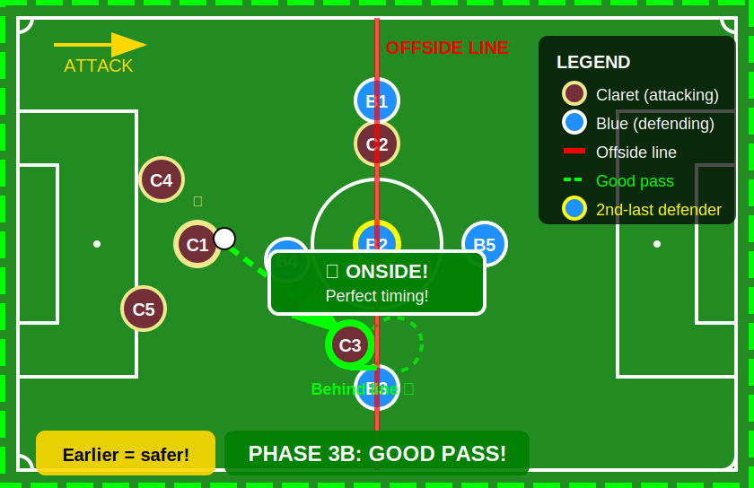
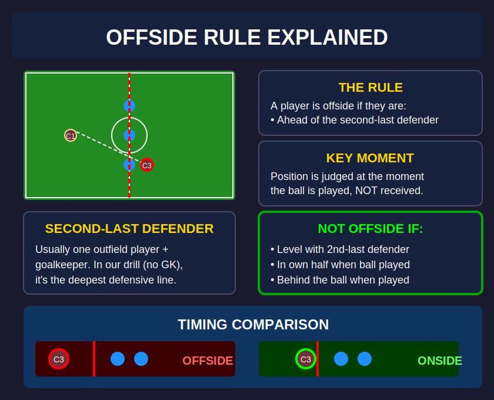

# Offside Drill - SVG Diagram Sequence

This directory contains SVG diagrams illustrating the offside drill for the football coaching simulator.

## Drill Overview

Two teams of 5 players (no goalkeepers):
- **Claret Team** (attacking) - `#722F37`
- **Blue Team** (defending) - `#1E90FF`

The drill teaches players to understand the offside rule through a controlled scenario where the timing of a forward pass is critical.

## Diagram Sequence

### Phase 1: Starting Positions
**File:** `offside-drill-phase1-start.svg`

Initial setup showing:
- C1 (controlled player) with ball, midway in Claret's half
- C3 in line with C1, ready to make a forward run
- Blue defensive line (B1, B2, B3) on the halfway line
- B4 pressing/guarding C1's forward pass option
- Offside line visible through the defensive line

---

### Phase 2: C3 Makes Forward Run
**File:** `offside-drill-phase2-run.svg`

Movement phase showing:
- C3 beginning their run toward the defensive line
- Ghost image showing original position
- Movement arrow indicating direction
- C3 still ONSIDE (behind the defensive line)
- Critical timing window for the pass

---

### Phase 3: Pass Made - OFFSIDE
**File:** `offside-drill-phase3-pass.svg`

Critical moment showing:
- C1 releases the pass
- C3 has moved PAST the defensive line
- Freeze frame at moment of pass
- Clear OFFSIDE decision with measurement
- Yellow border indicating freeze frame

---

### Phase 3B: Pass Made - ONSIDE (Alternative)
**File:** `offside-drill-phase3-onside.svg`

Successful timing showing:
- C1 releases the pass EARLIER
- C3 still BEHIND the defensive line at moment of pass
- Green indicators for successful onside pass
- Pass trajectory leads to space where C3 will run into

---

### Phase 4: Analysis & Explanation
**File:** `offside-drill-phase4-analysis.svg`

Educational breakdown:
- The offside rule explained simply
- Key moment: when ball is played (not received)
- Second-last defender concept
- Exceptions (level, own half, behind ball)
- Visual comparison of offside vs onside

---

## Player Positions Reference

### Claret Team (Attacking)
| Player | Role | Starting Position |
|--------|------|-------------------|
| C1 | Ball carrier (controlled, 📹) | Midway in own half, center |
| C2 | Support, holding | Halfway line, left |
| C3 | Runner (key player in drill) | In line with C1, right side |
| C4 | Support | Deep left |
| C5 | Support | Deep right |

### Blue Team (Defending)
| Player | Role | Starting Position |
|--------|------|-------------------|
| B1 | Defensive line | Halfway line, far left |
| B2 | Defensive line (2nd-last ref) | Halfway line, center |
| B3 | Defensive line | Halfway line, far right |
| B4 | Pressing | Between C1 and defensive line |
| B5 | Sweeper/cover | Behind defensive line |

---

## Coordinate System

- **Pitch dimensions:** 420 × 272 viewBox (scaled from 105m × 68m)
- **Center:** (210, 136)
- **Halfway line:** x = 210
- **Claret attacking direction:** Left → Right (positive x)

---

## Implementation Notes

These SVGs serve as:
1. **Design reference** for the 3D drill implementation
2. **Documentation** for drill behavior
3. **Exportable assets** for coaching materials
4. **Test cases** for offside detection logic

The drill system should be able to:
- Load these position configurations
- Animate transitions between phases
- Capture positions at "pass moment" for offside evaluation
- Display similar visual feedback (onside/offside indicators)
